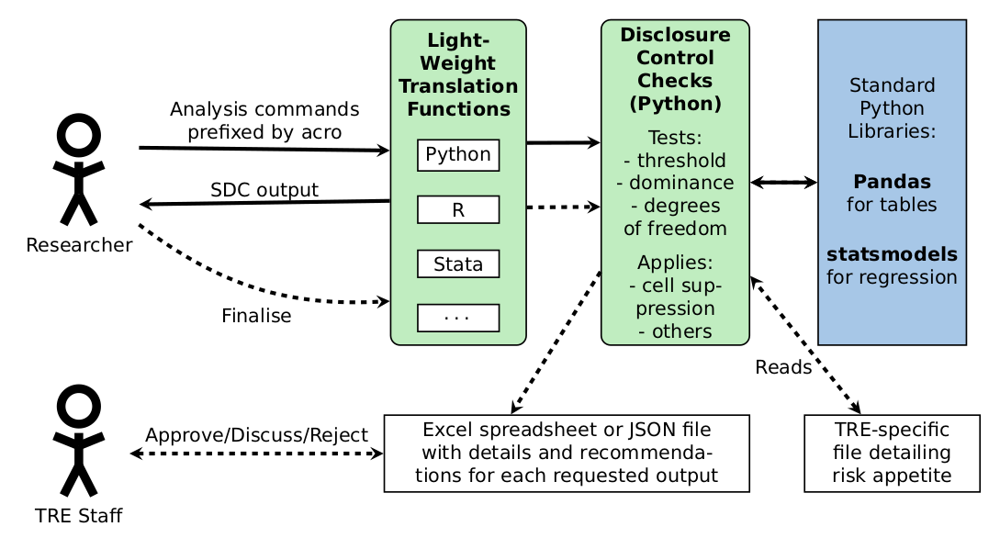

*******************************************************************************

## ACRO: Tools for the Automatic Checking of Research Outputs

Statistical agencies and other custodians of secure facilities such as Trusted
Research Environments (TREs) routinely require the checking of research outputs
for disclosure risk. This can be a time-consuming and costly task, requiring
skilled staff.

ACRO (Automatic Checking of Research Outputs) is an open source
tool for automating the statistical disclosure control (SDC) of research
outputs. ACRO assists researchers and output checkers by distinguishing between
research output that is safe to publish, output that requires further analysis,
and output that cannot be published because of substantial disclosure risk.

It does this by providing a light-weight 'skin' that sits over well-known
analysis tools, in a variety of languages researchers might use. This adds
functionality to:

*   identify potentially disclosive outputs against a range of commonly used
    disclosure tests;
*   suppress outputs where required;
*   report reasons for suppression;
*   produce simple summary documents TRE staff can use to streamline their
    workflow.

See the project [wiki](https://github.com/AI-SDC/ACRO/wiki) for details.

## Coding standards
Are also described in the project [wiki](https://github.com/AI-SDC/ACRO/wiki)

*******************************************************************************

This work was funded by UK Research and Innovation under Grant Number MC_PC_23006 as part of Phase 1 of the DARE UK (Data and Analytics Research Environments UK) programme (https://dareuk.org.uk/), delivered in partnership with Health Data Research UK (HDR UK) and Administrative Data Research UK (ADR UK). The specific project was Semi-Automatic Checking of Research Outputs (SACRO).

  
