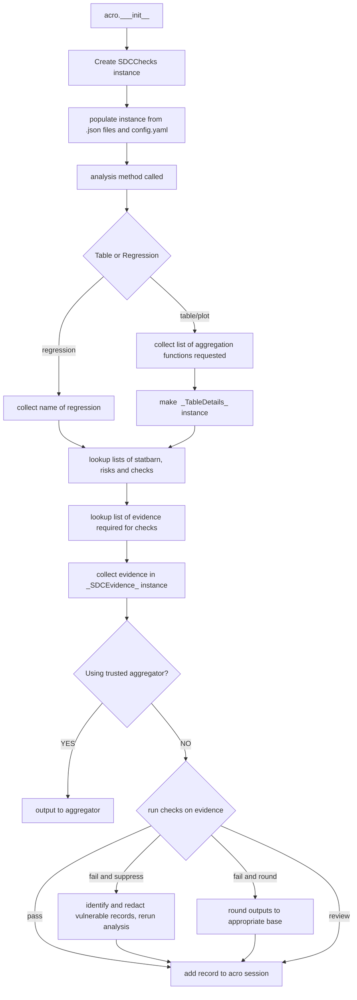
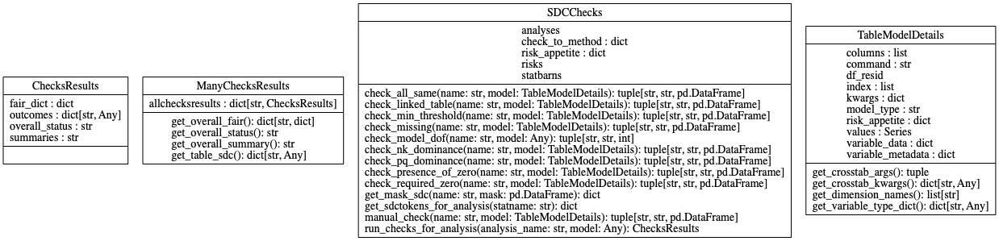

# Design brief for "ontology-driven" acro

## Rationale
1: The previous versions of the acro package suffered from a range of weaknesses, stemming from the fact that the choices of which checks needs to be run were hard-coded.
- No simple mechanism for outputting FAIR statements of which checks had been run and why
- No simple mechanism for verifying this conformed to the knowledge base embedded in the statbarns work
- Lots of work needed whenever a contributor wanted to add support for a new type of analysis.
- Some functions (especially acrotables) had become bloated to the point of being hard to understand and maintain.
- There is no easy way to provide help and descriptions of the SDC process relevant to a given analysis to a researcher.

2: The previous version of the code removed empty rows/columns from output tables which created a world of pain when applying suppression. Arguably, it also provides a vector for class disclosure and other inference attacks.

3: The previous version created suppression 'masks' which were applied to suppress tables. This made it very difficult to correctly recompute marginal totals for e.g. means/medians,...

4: Looking forward, to operate in the mode of federation with a _Trusted Aggregator_, it is necessa to separate the process of running a check into two parts: (i) collecting the evidence (e.g. getting a table showing the number of records for each cell) , then (ii) applying a logical test to that evidence (e.g. testing cell-by-cell if those numbers are over the minimum cell threshold).   In _stand-alone_ mode these two acts follow each other.

## Chosen solution
1: The chosen solution was to read in this knowledge 'on session initiation' so that:
 code to instantiate analyses just need to specify their type according to the [statbarnsdc ontology](w3id.org/statbarnsdc). From there it is possible to unambiguously define the 'statbarn' - and hence the associated risks, checks and potential mitigations, and to call those and collate (and output) the evidence needed for risk assessment.

This has the added benefit that as thinking around SDC protocols  adapts and changes (for example, moving _histograms_ from the __Frequency_ statbarns to a new one, all that is needed is to change the formal ontology, not the code base itself.

However, TRE airlock procedures mean it is may not be  possible to read from w3id.org `on-the-fly`.
- So in practice we provide a separate program `ontology_handler.py` which captures the knowledge in 4 json-encoded lookup-tables: `analyses.json`, `checks.json`,`risks.json` and `statbarns.json`.
- This should be run (by a code-runner action?) prior to the generation of any new release of the code, and the json files included with the pypi/Conda distributions.

- Note these `.json` files contain all the URIs and textual description of analyses, statbarns, risks, checks and mitigations, so they are present  and potentially accessible within the TRE. It is a matter for future work to decide how best to make these available to the researcher

2: We now override the default pandas settings to enforce `dropna=False` on outputs.

3: We now apply suppression by redacting the data (i.e. identify and remove records falling into _disclosive_ cells) and then re-running the table creation process. This has the benefit of using pandas functionality to correctly compute marginals for different aggregation functions.

## Flowchart


## Implications
We have created several new classes to support this work.



1: `TableModelDetails` : An abstract class supporting the information needed to create tabular outputs from commands such as `crosstab()`, `pivot_table()`, `pie`, `hist`, `survival` in a standardised format.

These commands all need similar information to perform SDCchecks, and running some of the checks requires creating identical tables but with different aggregatino functions. Hence this class avoids lots of repeated code and type checking, and abstracts from the specifics of the different syntax, via methods such as `get_crosstab_args()`, `get_crosstab_kwargs() etc.

The class also provides attributes and methods for capturing meta-data around the 'dimensions' (e.g. the categorical factors used to define rows/columns). In turn that supports preserving the range of possible values for dimensions via  the mechanism of  pandas `CategoricalDtype`s  (and setting `observed=False`) so they are not lost when data is redacted.

Finally, since this class knows the structure of the desired table, it also provides support for producing tables with the same structure that are needed for constructing evidence. Specifically: `get_count_table()`, `get_allfalse_table`, `get_zeros_table` and `get_newagg_table` (which accepts different aggregation functions).

2: `SDCChecks()` , with associate dataclasses `ChecksResults`,  `ManyChecksResults`, and `SDCEvidence' provides support for the main process of risk assessment.

Thus for example in a regression model we just do:
```
        ##### Step 1: build the output
        model = sm.OLS(endog, exog=exog, missing=missing, hasconst=hasconst, **kwargs)
        results = model.fit()

        ##### Step 2: identify type of output and gather evidence
        analysis_name = "GeneralLinearModel"
        evidence: SDCEvidence = self.sdc_checks.get_evidence_forall_analyses(
            [analysis_name], model
        )
        checkresults: ChecksResults = self.sdc_checks.run_checks_for_analysis(
            analysis_name, evidence, model
        )
```


The added benefit of this class is that it has attributes for storing the risk appetite.
Thus an ACRO object (session) contains an instance of this class created during `acro.__init__()`
rather than holding versions of the relevant parameters in `acro_tables.py`.

3: To reduce clutter, many of the functions previously held in `acro_tables.py` are moved to a support file `table_utils.py`. There is probably plenty scope for further refactoring of this code  - for example, into a `Redact()` class - which may make the codebase easier to maintain.

## Some more detail on process flow

1. User starts an acro session.
    - SDCChecks() object (`self.sdc_checks`) is created and populated from (i) The risk appetite read from the config file and (ii) The contents of the analyses/checks/statbarns/risks.json files

2. Researcher requests output e.g. a table:
 - a `TableModelDetails` instance is created to store the data, row/column/values variables, aggregation function and other parameters needed  to recreate the table.
 - The requested output is created.
 - The list of analyses requested to be reported within the table (i.e. the _aggregation functions_) is first used to drive first the collection of all the evidence neededfor risk assessment e.g.
```
        #### Step 2 run the checks and gather evidence
        analysis_names: list[str] = aggfunc_to_strings(aggfunc)
        evidence: SDCEvidence = self.sdc_checks.get_evidence_forall_analyses(
            analysis_names, model_details
        )

        # extra layer of loops as requested tables may have more than one agg func
        collatedres = ManyChecksResults()
        for analysis in analysis_names:
            collatedres.allchecksresults[analysis] = (
                self.sdc_checks.run_checks_for_analysis(
                    analysis, evidence, model_details
                )
            )

        logging.debug(get_debugging_table_analysis(collatedres.allchecksresults))

        collated_assessment = collate_risk_assessments(
            table, collatedres.allchecksresults
        )

```
- the method `get_evidence_forall_analyses` starts by using  the lookup tables to determine the relevant SDC details, and thus checks need to be run and reported, and what evidence they require:
```
       """Collate the evidence needed to do SDC for all the analyses requested by a query."""
        evidence_needed: set = set()
        for analysis_name in analyses:
            checks_needed = self.get_sdctokens_for_analysis(analysis_name)[
                "checks_needed"
            ]
            for check in checks_needed:
                evidence_needed.update(self.checks[check]["evidence"])
        logger.debug(
            f"model has type {type(model)}, evidence needed for analyses {analyses} is {evidence_needed}"
        )
        thevidence = SDCEvidence()
        thevidence.populate_from_list(evidence_needed, model)
        return thevidence
```
- the `SDCEvidence()` dataclass has a method `populate_from_list()`.

  - For a model of type `statsmodels.Regression()` it queries the residual degrees of freedom.
  - For something of type `TableModelDetails` it generates the required set of `masks`.
  - For both it populates a list of dependent and independent variables (reported to assist in secondary disclosure control)

3. In _standalone_ mode the rest of the risks assessment carries on:
- the method `run_checks_for_analysis` starts by using  the lookup tables to determine the relevant SDC details and which checks need to be run and reported:
  ```        sdc_dict = self.get_sdctokens_for_analysis(analysis_name)```

Then loops through these making calls to simple method which return appropriate masks.
```
      for check in sdc_dict["checks_needed"]:
            checkfunc = self.check_to_method[check]
            status, summary, outcome = checkfunc(analysis_name, evidence model)
            ...
```

Finally the results (status, summary, and dictionary of masks) of the different checks are collated and returned in a `ChecksResults` dataclass object.

## TODO
Report on status of checks and where further work is needed. Not sure that belongs in this brief?
