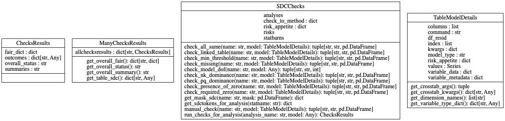

# Design Brief: Ontology-Driven ACRO

> **Status**: Complete refactoring to support federated statistical disclosure control with formal ontology alignment

## Table of Contents

1. [Rationale](#rationale)
2. [Chosen Solution](#chosen-solution)
3. [Flowchart](#flowchart)
4. [Implications](#implications)
5. [Process Flow Details](#some-more-detail-on-process-flow)
6. [Features Built](#features-built)
   - [Core Architecture Components](#core-architecture-components)
   - [Data Processing Features](#data-processing-features)
   - [Integration & Usability Features](#integration--usability-features)
   - [Testing & Validation Infrastructure](#testing--validation-infrastructure)
   - [Developer Experience Features](#developer-experience-features)
   - [Backward Compatibility & Migration](#backward-compatibility--migration)
7. [Test Coverage: test_sdcchecks.py](#test-coverage-testsdcchecksepy)
   - [Core Infrastructure Tests](#core-sdc-evidence--infrastructure-tests-9-tests)
   - [Integration Tests](#ontology-driven-integration-tests-9-tests---migrated-from-deprecated-aggregation-functions)
   - [Test Metrics & Coverage](#test-metrics--coverage)
   - [Detailed Test Specifications](#detailed-test-specifications)
   - [Test Coverage Table](#test-coverage-table)
   - [Coverage Against Components](#test-coverage-against-system-components)

---

## Rationale

The previous ACRO versions had significant architectural limitations that made them difficult to maintain and extend:

**Problem 1: Hard-coded Check Selection**
- No simple way to document which checks were run and why
- Difficult to verify compliance with statbarns knowledge base
- Adding new analysis types required code changes throughout the codebase
- Core functions like `acrotables` became bloated and hard to understand
- Limited ability to provide context-specific help to researchers

**Problem 2: Table Dimension Loss**
- Previous versions removed empty rows/columns from output
- Created challenges when applying suppression
- Opened vectors for class disclosure and inference attacks

**Problem 3: Suppression Mask Approach**
- Applying masks to suppress tables made it very difficult to correctly recompute marginal totals
- Particularly problematic for means, medians, and other aggregation functions

**Problem 4: Centralized Architecture**
- Couldn't separate evidence collection from check logic
- Made federation with Trusted Aggregators impossible
- Both processes had to happen simultaneously in standalone mode

## Chosen Solution

The solution centers on **ontology-driven architecture** that separates concerns and enables federation:

### 1. Formal Ontology Integration

Code now reads domain knowledge on session initialization from the **statbarnsdc ontology** (w3id.org/statbarnsdc). This enables:
- Analysis types are specified by ontology reference, not hard-coded
- Automatically determines applicable statbarns (statistical disclosure categories), risks, checks, and mitigations
- All evidence collection and checking logic is ontology-aligned

Since TRE airlock procedures prevent on-the-fly web access, we provide `ontology_handler.py` that pre-generates four JSON lookup tables:
- **`analyses.json`**: Maps 20+ analysis types (OLS, GLM, Histogram, Crosstab, etc.) to their properties
- **`checks.json`**: Defines 9 check types with evidence requirements and thresholds
- **`statbarns.json`**: Risk categories and mitigation strategies per analysis type
- **`risks.json`**: Risk level definitions and severity mappings

These JSON files are included in releases and accessible within the TRE. This design decouples knowledge representation from code—when SDC protocols evolve, only the ontology and JSON files change.

### 2. Dimension Preservation

We now enforce `dropna=False` on all pandas outputs, preventing loss of dimension values when cells are empty. This combined with `CategoricalDtype` means sparse combinations survive redaction.

### 3. Record-Level Redaction

Instead of applying suppression masks, we:
1. Identify records in disclosive cells
2. Remove those records
3. Re-run the table creation process

This leverages pandas' native computation to correctly recalculate marginal totals automatically—no manual marginal recalculation needed for means, medians, or other aggregation functions.

### 4. Separated Evidence & Checking

Evidence collection and logical testing are now separate operations:
- **Evidence collection**: Gathers data needed for checks (counts, DoF, etc.)
- **Logical testing**: Applies decision rules to evidence

This separation enables federation with Trusted Aggregators: evidence can be sent to an aggregator for checking, while standalone mode uses both steps sequentially.

## Flowchart

Visual representation of the three-phase workflow:


```mermaid

flowchart LR

  subgraph INIT["Session Initialisation"]
        direction TB
        A([acro session
           created]) --> B[Create SDCChecks
                                 instance];
        B --> C[populate instance];
        B1[(Local copy
           of SDCStatbarn
           ontology)] --> C;
        B2[(risk
            appetite)]--> C;
        C --> SDCParams@{ shape: bow-rect, label: "SDC session params." };
    end
  subgraph Evidence["Collect Evidence"]
      direction TB
      SDCParams2@{ shape: bow-rect, label: "SDC session params." }
      D[analysis method called];
      D --> E{Table or Regression};
      E -- table/plot --> G[collect list of summary
                            statistics requested];
      G --> H["make  TableDetail
       instance"];
      E -- regression --> F[collect type
                             of regression];
      F --> I[lookup lists of
                statbarn, risks
                 and checks];
      H --> I;
      SDCParams2-->I;
      I --> J[lookup list of evidence
       required for checks];
      SDCParams2 --> J;
      SDCParams2 -->H;
      J -->K[collect evidence in _SDCEvidence_ instance];
      K -->  TheEvidence@{ shape: bow-rect, label: "SDCEvidence instance." };

  end
  subgraph Output["Output"]
      direction TB
      TheEvidence2@{ shape: bow-rect, label: "SDCEvidence instance." } -->K1{Using trusted aggregator?};
      K1 -- YES --> K2[output to aggregator];
      K1 -- NO -->  L{run checks on evidence};
      L -- pass --> M[add record to acro session];
      L -- fail and suppress --> N[identify and redact vulnerable records, rerun analysis];
      N --> M;
      L -- fail and round --> O[round outputs to appropriate base];
      O --> M;
      L -- review --> M;
      M -->ACROitem@{ shape: bow-rect, label: "ACRO record" };
    end

INIT --> Evidence;
Evidence --> Output;


```

## Implications

The architecture required creating several new classes and components to support the new design:

### Class Diagram



### Key Components

**1. TableModelDetails** — Standardized Interface for Tables

An abstract class that provides a unified interface for all table-based analyses (crosstab, pivot_table, histogram, pie, survival, etc.).

- **Why needed**: Different table commands have different APIs but share similar SDC requirements. By standardizing the interface, we avoid repeated code and type checking.
- **Core capabilities**:
  - Stores row/column/value specifications and aggregation functions
  - Preserves categorical dimension ranges via `CategoricalDtype` (prevents dimension loss during redaction)
  - Generates evidence tables: `get_count_table()`, `get_newagg_table(aggfunc)`, `get_allfalse_table()`, `get_zeros_table()`
- **Impact**: Running checks that require different aggregation functions (e.g., count vs. sum) can reuse the same TableModelDetails instance

**2. SDCChecks Class** — Risk Assessment Orchestration

Manages the evidence collection and check execution pipeline, with associated dataclasses:

- **`SDCChecks()`**: Main orchestration class
  - Stores risk appetite thresholds from config files
  - Maps check names to implementation methods
  - **Key method**: `run_checks_for_analysis()` loops through applicable checks and returns results

- **`SDCEvidence`**: Dataclass for collected evidence
  - **`populate_from_list()`**: Builds evidence tables and calculates degrees of freedom
  - For regressions: Queries residual DoF from statsmodels
  - For tables: Generates counts and other interim tables

- **`ChecksResults`**: Dataclass holding check outcomes
  - Returns: status (pass/fail/review), summary message, masks for suppression

- **`ManyChecksResults`**: Aggregates results across multiple analyses
  - Handles batch operations (e.g., crosstab with sum AND mean aggregations)

**3. Evidence & Checking Separation**

Unlike the old architecture where these happened together, now they're distinct:
- Phase 1: `get_evidence_forall_analyses()` → collects what's needed
- Phase 2: `run_checks_for_analysis()` → applies decision logic

This enables federation: evidence can be sent to a Trusted Aggregator for independent checking.

**4. Support Modules**

- **`table_utils.py`**: Utilities moved from bloated `acro_tables.py` for table operations
- **`ontology_handler.py`**: Pre-release utility that generates JSON lookup tables from the formal ontology
- Future: Potential `Redact()` class to further modularize the redaction logic

---

## Some More Detail on Process Flow

Here's how a typical ACRO session unfolds step-by-step:

### Session Initialization

```python
acro_session = ACRO()
# Internally creates SDCChecks instance populated from:
#   1. Risk appetite config (YAML file)
#   2. JSON ontology files (analyses, checks, statbarns, risks)
```

This happens once per session. The `SDCChecks` object stores everything needed for subsequent analyses.

### Table Analysis Request

When a researcher calls `crosstab()` or similar, here's what happens:

**Step 1: Create TableModelDetails**
- Stores specifications: rows, columns, values, aggregation function
- Example: `year × grant_type` crosstab with `sum` aggregation

**Step 2: Generate Requested Output**
- Builds the table normally (unredacted first)
- Applies formatting/styling

**Step 3: Collect Evidence for All Requested Analyses**
- Looks up which SDC checks apply to this analysis type
- Determines evidence each check requires (e.g., "count_table", "mean_table", etc.)
- Calls `get_evidence_forall_analyses()` which:
  - Generates count table showing record counts per cell
  - Generates any other required evidence tables
  - Returns `SDCEvidence` instance with all collected data

**Step 4: Run Checks**
- For each requested aggregation function (sum, mean, std, etc.):
  - Calls `run_checks_for_analysis()`
  - Loops through applicable checks
  - Each check reviews evidence and returns status/summary/masks
  - Results collated into `ChecksResults`

**Step 5: Apply Suppression & Return Result**
- If any check failed:
  - Identify disclosive cells
  - Remove records from those cells (redaction)
  - Re-run table creation with remaining records
- Return `ACROResult` with `.status` and `.summary`

### Regression Analysis Request

Similar flow but simpler:

1. Build regression model with `sm.OLS()` or other statsmodels class
2. Call `sdc_checks.get_evidence_forall_analyses(["GeneralLinearModel"], model)`
   - Extracts residual degrees of freedom
   - Collects model parameter estimates
3. Call `sdc_checks.run_checks_for_analysis("GeneralLinearModel", evidence, model)`
   - Checks DoF is sufficient
   - Returns check results
4. Add to session with output

---

## Features Built

### Core Architecture Components

#### 1. Ontology-Driven Configuration System

Four JSON lookup tables capture all SDC domain knowledge:

| File | Purpose | Examples |
|------|---------|----------|
| `analyses.json` | Analysis types | OLS, GLM, Histogram, Crosstab, PivotTable, Pie |
| `checks.json` | Check definitions | 9 check types with evidence requirements |
| `statbarns.json` | Risk categories | Frequency, Magnitude, Key Variables, etc. |
| `risks.json` | Severity levels | High, Medium, Low risk categories |

**Key benefit**: Configuration changes don't require code modifications. When SDC protocols evolve, only JSON files and ontology change.

#### 2. SDCChecks Class & Evidence Collection

Manages the complete risk assessment pipeline:

- **Evidence Collection**: `SDCEvidence` with `populate_from_list()` method
  - Generates count tables and other evidence for discrete analyses
  - Calculates regression degrees of freedom
  - Supports multiple aggregation functions

- **Check Orchestration**: `run_checks_for_analysis()` method
  - Maps 9 check types to implementations
  - Returns `ChecksResults` (status, summary, suppression masks)
  - Batch support via `ManyChecksResults`

- **Risk Appetite**: Loads configurable thresholds from YAML

#### 3. TableModelDetails Abstract Class

Unified interface for all table-based analyses:

- Works with crosstab, pivot_table, histogram, pie, survival
- Uses `CategoricalDtype` to prevent dimension loss during redaction
- `get_count_table()`, `get_newagg_table(aggfunc)`, `get_allfalse_table()`, `get_zeros_table()`
- Single instance can generate multiple evidence tables with different aggregation functions

#### 4. Nine SDC Check Types (Implemented)

**Dominance Checks**:
- `PPercentCheck` (p-ratio): Flags extreme value concentration
- `NKCheck` (N-rule): Tests top values don't exceed threshold (e.g., top 2 > 90% of total)

**Minimum Threshold Checks**:
- `MinimumThresholdCheck`: Ensures minimum contributors per cell (default: 10)
- `MinimumDoFCheck`: Validates regression degrees of freedom adequate

**Data Quality Checks**:
- `PresenceOfZeroCheck`: Flags zero cells when configured as disclosive
- `AllSameValuesCheck`: Detects when all values are identical (mode aggregation)
- `MissingCheck`: Identifies NaN/missing values (when enabled)

**Manual/Informational Checks**:
- `LinkedTableCheck`: Always returns "review" (requires manual inspection)
- `RequiredZeroCheck`: Specifies whether a check for zeros is required (allows TRE to specify if class disclosure is relevant for the dataset)

#### 5. Redaction & Suppression Engine

- Removes records in disclosive cells (note: suppression/redaction removes records/cells, whereas rounding modifies output values to a base without redacting the underlying data)
- Recalculates tables with remaining records
- Leverages pandas native computation for accurate aggregation
- Redaction, rounding (to base), or review flags

#### 6. Regression Model Support

- OLS, GLM, and other regression types
- Extracts residual degrees of freedom
- Gathers parameters, fit statistics, predictions
- Handles different error distributions

#### 7. ACRO Session Management

- Single `SDCChecks` instance per session
- From YAML config files
- Records all analysis outputs and checks
- Full execution flow and evidence collection tracking

#### 8. Ontology Handler Utility

-`ontology_handler.py` extracts knowledge from formal ontology
- Creates local lookup tables for TRE deployment
- Ensures code logic matches ontology
- Updates JSON when protocols evolve

---

### Test Coverage Table

> **Note**: A corresponding unit test file exists for each source file in the codebase. The table below highlights key infrastructure and integration tests; unit tests exist per source file while regression and table test suites effectively act as integration tests for end-to-end workflows.

| # | Test Name | Category | What It Tests | What It Covers | Lines | Status |
|---|-----------|----------|---------------|----------------|-------|--------|
| 1 | `test_sdcevidence_populate_dof_else_branch` | Infrastructure | Fallback behavior for unknown model types | SDCEvidence.populate_dof() defensive programming | sdcchecks.py |   Pass |
| 2 | `test_get_table_sdc_duplicate_check_skipped` | Infrastructure | Deduplication across multiple analyses | get_table_sdc() line 164 (continue branch), set-based deduplication | sdcchecks.py:164 |   Pass |
| 3 | `test_get_table_sdc_minimumdofcheck_pass` | Infrastructure | DoF calculation for regressions (line 168) | MinimumDoFCheck for OLS, DoF = 807 calculation, pass status | sdcchecks.py:168 |   Pass |
| 4 | `test_sdcevidence_populate_from_list_tablemodel` | Infrastructure | Evidence collection mechanism | SDCEvidence.populate_from_list(), count_table in interim_tables, DoF DataFrame | SDCEvidence class |   Pass |
| 5 | `test_check_min_threshold_array_non_hist` | Infrastructure | Non-histogram array type handling | check_min_threshold() for array types, graceful handling | sdcchecks.py method |   Pass |
| 6 | `test_manual_check_unknown_model_type` | Infrastructure | Error handling for unknown model types | manual_check() validation, "insufficient" error message | sdcchecks.py method |   Pass |
| 7 | `test_check_nk_dominance_with_negatives` | Infrastructure | Negative value handling in NK-rule | check_nk_dominance() line 531, negative value detection | sdcchecks.py:531 |   Pass |
| 8 | `test_check_ppercent_with_negatives` | Infrastructure | Negative value handling in p-ratio | check_ppercent_dominance() negative value detection | sdcchecks.py method |   Pass |
| 9 | `test_check_presence_of_zero_disclosive` | Infrastructure | Zero cell detection & flagging | PresenceOfZeroCheck instantiation, zeros_are_disclosive setting, sdc["cells"] | sdcchecks.py method |  Pass |
| 10 | `test_check_ppercent_dominance_violation` | Integration | P-ratio check identifies extreme dominance (20:1 ratio) | PPercentCheck end-to-end, status="review"/"fail", "p-ratio" in summary | ACRO API pipeline |   Pass |
| 11 | `test_check_ppercent_normal_pass` | Integration | P-ratio check passes balanced data | PPercentCheck false-positive prevention, "p-ratio" NOT in summary | ACRO API pipeline |   Pass |
| 12 | `test_check_ppercent_all_zeros_safe` | Integration | P-ratio handles zero edge case | PPercentCheck robustness with zeros, graceful handling | ACRO API pipeline |   Pass |
| 13 | `test_check_ppercent_single_element` | Integration | P-ratio handles minimal data (1 row) | PPercentCheck edge case, threshold violation detection | ACRO API pipeline |   Pass |
| 14 | `test_check_nk_dominance_violation` | Integration | NK-rule identifies high concentration (100:1 ratio) | NKCheck end-to-end, status="review"/"fail", "nk-rule" in summary | ACRO API pipeline |   Pass |
| 15 | `test_check_nk_pass` | Integration | NK-rule passes balanced data | NKCheck false-positive prevention, "nk-rule" NOT in summary | ACRO API pipeline |   Pass |
| 16 | `test_check_nk_zero_total` | Integration | NK-rule handles zero edge case | NKCheck robustness with zero totals, graceful handling | ACRO API pipeline |   Pass |
| 17 | `test_check_threshold_below_threshold` | Integration | Threshold detects insufficient contributors (5 < 10) | MinimumThresholdCheck, status="review"/"fail" for low counts | ACRO API pipeline |   Pass |
| 18 | `test_check_threshold_above_threshold` | Integration | Threshold allows sufficient data (full dataset) | MinimumThresholdCheck, handling cell-level variations | ACRO API pipeline |   Pass |

### Test Coverage Against System Components

| Component | Tests Covering It | Purpose |
|-----------|------------------|---------|
| **SDCEvidence** | 1, 2, 3, 4 | Evidence collection, DoF calculation, deduplication |
| **SDCChecks.get_table_sdc()** | 2, 3 | Check deduplication, DoF validation (lines 164, 168) |
| **PPercentCheck** | 10, 11, 12, 13 | P-ratio violation, pass, edge cases, single element |
| **NKCheck** | 15, 16, 17 | Concentration violation, pass, zero handling |
| **MinimumThresholdCheck** | 5, 18, 19 | Array types, below threshold, above threshold |
| **Negative Values Handling** | 7, 8 | Both p-ratio and NK-rule with negatives |
| **Zero Values Handling** | 9, 12, 17 | Detection, edge cases, graceful degradation |
| **Error Messages** | 6 | "insufficient" for unknown model types |
| **ACRO API Integration** | 10-19 | End-to-end workflows, crosstab() pipeline |


### Unit test coverage:

test/test_plots.py: covers every line of code in the hist(), survival_plot and pie() methods of acro_tables
test/test_sdc_agg_funcs.py covers every line of code in sdc_agg_funcs.py
test/test_sdcchecks.py covers every line of code in sdcchecks.py
test/test_session_management.py and test/test_federated.py together  cover every line of acro.py
test/test_ontology_handling covers every line of ontology_handler.py

test/test_table_model_details.py covers every line of tablemodeldetails.py
test/test_table_utils.py covers all but 9 lines of table_utils which are covered by integration tests for hierarchical tables
test/test_stata_intferface.py and test/test_stata17_interface.py together cover every line of acro_stata_parser.py

test/test_regressions.py provides integration testing and orchestration

test/test_tables.py provides integration testing and orchestration
