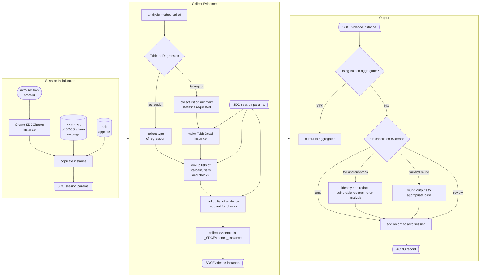

# Design Brief: Ontology-Driven ACRO

> **Status**: Complete refactoring to support federated statistical disclosure control with formal ontology alignment

## Table of Contents

1. [Rationale](#rationale)
2. [Chosen Solution](#chosen-solution)
3. [Flowchart](#flowchart)
4. [Implications](#implications)
5. [Process Flow Details](#some-more-detail-on-process-flow)
6. [Features Built](#features-built)
   - [Core Architecture Components](#core-architecture-components)
   - [Data Processing Features](#data-processing-features)
   - [Integration & Usability Features](#integration--usability-features)
   - [Testing & Validation Infrastructure](#testing--validation-infrastructure)
   - [Developer Experience Features](#developer-experience-features)
   - [Backward Compatibility & Migration](#backward-compatibility--migration)
7. [Test Coverage: test_sdcchecks.py](#test-coverage-testsdcchecksepy)
   - [Core Infrastructure Tests](#core-sdc-evidence--infrastructure-tests-9-tests)
   - [Integration Tests](#ontology-driven-integration-tests-9-tests---migrated-from-deprecated-aggregation-functions)
   - [Test Metrics & Coverage](#test-metrics--coverage)
   - [Detailed Test Specifications](#detailed-test-specifications)
   - [Test Coverage Table](#test-coverage-table)
   - [Coverage Against Components](#test-coverage-against-system-components)

---

## Rationale

The previous ACRO versions had significant architectural limitations that made them difficult to maintain and extend:

**Problem 1: Hard-coded Check Selection**
- No simple way to document which checks were run and why
- Difficult to verify compliance with statbarns knowledge base
- Adding new analysis types required code changes throughout the codebase
- Core functions like `acrotables` became bloated and hard to understand
- Limited ability to provide context-specific help to researchers

**Problem 2: Table Dimension Loss**
- Previous versions removed empty rows/columns from output
- Created challenges when applying suppression
- Opened vectors for class disclosure and inference attacks

**Problem 3: Suppression Mask Approach**
- Applying masks to suppress tables made it very difficult to correctly recompute marginal totals
- Particularly problematic for means, medians, and other aggregation functions

**Problem 4: Centralized Architecture**
- Couldn't separate evidence collection from check logic
- Made federation with Trusted Aggregators impossible
- Both processes had to happen simultaneously in standalone mode

## Chosen Solution

The solution centers on **ontology-driven architecture** that separates concerns and enables federation:

### 1. Formal Ontology Integration

Code now reads domain knowledge on session initialization from the **statbarnsdc ontology** (w3id.org/statbarnsdc). This enables:
- Analysis types are specified by ontology reference, not hard-coded
- Automatically determines applicable statbarns (statistical disclosure categories), risks, checks, and mitigations
- All evidence collection and checking logic is ontology-aligned

Since TRE airlock procedures prevent on-the-fly web access, we provide `ontology_handler.py` that pre-generates four JSON lookup tables:
- **`analyses.json`**: Maps 20+ analysis types (OLS, GLM, Histogram, Crosstab, etc.) to their properties
- **`checks.json`**: Defines 9 check types with evidence requirements and thresholds
- **`statbarns.json`**: Risk categories and mitigation strategies per analysis type
- **`risks.json`**: Risk level definitions and severity mappings

These JSON files are included in releases and accessible within the TRE. This design decouples knowledge representation from code—when SDC protocols evolve, only the ontology and JSON files change.

### 2. Dimension Preservation

We now enforce `dropna=False` on all pandas outputs, preventing loss of dimension values when cells are empty. This combined with `CategoricalDtype` means sparse combinations survive redaction.

### 3. Record-Level Redaction

Instead of applying suppression masks, we:
1. Identify records in disclosive cells
2. Remove those records
3. Re-run the table creation process

This leverages pandas' native computation to correctly recalculate marginal totals automatically—no manual marginal recalculation needed for means, medians, or other aggregation functions.

### 4. Separated Evidence & Checking

Evidence collection and logical testing are now separate operations:
- **Evidence collection**: Gathers data needed for checks (counts, DoF, etc.)
- **Logical testing**: Applies decision rules to evidence

This separation enables federation with Trusted Aggregators: evidence can be sent to an aggregator for checking, while standalone mode uses both steps sequentially.

## Flowchart

Visual representation of the three-phase workflow:


```mermaid

flowchart LR

  subgraph INIT["Session Initialisation"]
        direction TB
        A([acro session
           created]) --> B[Create SDCChecks
                                 instance];
        B --> C[populate instance];
        B1[(Local copy
           of SDCStatbarn
           ontology)] --> C;
        B2[(risk
            appetite)]--> C;
        C --> SDCParams@{ shape: bow-rect, label: "SDC session params." };
    end
  subgraph Evidence["Collect Evidence"]
      direction TB
      SDCParams2@{ shape: bow-rect, label: "SDC session params." }
      D[analysis method called];
      D --> E{Table or Regression};
      E -- table/plot --> G[collect list of summary
                            statistics requested];
      G --> H["make  TableDetail
       instance"];
      E -- regression --> F[collect type
                             of regression];
      F --> I[lookup lists of
                statbarn, risks
                 and checks];
      H --> I;
      SDCParams2-->I;
      I --> J[lookup list of evidence
       required for checks];
      SDCParams2 --> J;
      SDCParams2 -->H;
      J -->K[collect evidence in _SDCEvidence_ instance];
      K -->  TheEvidence@{ shape: bow-rect, label: "SDCEvidence instance." };

  end
  subgraph Output["Output"]
      direction TB
      TheEvidence2@{ shape: bow-rect, label: "SDCEvidence instance." } -->K1{Using trusted aggregator?};
      K1 -- YES --> K2[output to aggregator];
      K1 -- NO -->  L{run checks on evidence};
      L -- pass --> M[add record to acro session];
      L -- fail and suppress --> N[identify and redact vulnerable records, rerun analysis];
      N --> M;
      L -- fail and round --> O[round outputs to appropriate base];
      O --> M;
      L -- review --> M;
      M -->ACROitem@{ shape: bow-rect, label: "ACRO record" };
    end

INIT --> Evidence;
Evidence --> Output;


```

## Implications

The architecture required creating several new classes and components to support the new design:

### Class Diagram


### Key Components

**1. TableModelDetails** — Standardized Interface for Tables

An abstract class that provides a unified interface for all table-based analyses (crosstab, pivot_table, histogram, pie, survival, etc.).

- **Why needed**: Different table commands have different APIs but share similar SDC requirements. By standardizing the interface, we avoid repeated code and type checking.
- **Core capabilities**:
  - Stores row/column/value specifications and aggregation functions
  - Preserves categorical dimension ranges via `CategoricalDtype` (prevents dimension loss during redaction)
  - Generates evidence tables: `get_count_table()`, `get_newagg_table(aggfunc)`, `get_allfalse_table()`, `get_zeros_table()`
- **Impact**: Running checks that require different aggregation functions (e.g., count vs. sum) can reuse the same TableModelDetails instance

**2. SDCChecks Class** — Risk Assessment Orchestration

Manages the evidence collection and check execution pipeline, with associated dataclasses:

- **`SDCChecks()`**: Main orchestration class
  - Stores risk appetite thresholds from config files
  - Maps check names to implementation methods
  - **Key method**: `run_checks_for_analysis()` loops through applicable checks and returns results

- **`SDCEvidence`**: Dataclass for collected evidence
  - **`populate_from_list()`**: Builds evidence tables and calculates degrees of freedom
  - For regressions: Queries residual DoF from statsmodels
  - For tables: Generates counts and other interim tables

- **`ChecksResults`**: Dataclass holding check outcomes
  - Returns: status (pass/fail/review), summary message, masks for suppression

- **`ManyChecksResults`**: Aggregates results across multiple analyses
  - Handles batch operations (e.g., crosstab with sum AND mean aggregations)

**3. Evidence & Checking Separation**

Unlike the old architecture where these happened together, now they're distinct:
- Phase 1: `get_evidence_forall_analyses()` → collects what's needed
- Phase 2: `run_checks_for_analysis()` → applies decision logic

This enables federation: evidence can be sent to a Trusted Aggregator for independent checking.

**4. Support Modules**

- **`table_utils.py`**: Utilities moved from bloated `acro_tables.py` for table operations
- **`ontology_handler.py`**: Pre-release utility that generates JSON lookup tables from the formal ontology
- Future: Potential `Redact()` class to further modularize the redaction logic

---

## Some More Detail on Process Flow

Here's how a typical ACRO session unfolds step-by-step:

### Session Initialization

```python
acro_session = ACRO()
# Internally creates SDCChecks instance populated from:
#   1. Risk appetite config (YAML file)
#   2. JSON ontology files (analyses, checks, statbarns, risks)
```

This happens once per session. The `SDCChecks` object stores everything needed for subsequent analyses.

### Table Analysis Request

When a researcher calls `crosstab()` or similar, here's what happens:

**Step 1: Create TableModelDetails**
- Stores specifications: rows, columns, values, aggregation function
- Example: `year × grant_type` crosstab with `sum` aggregation

**Step 2: Generate Requested Output**
- Builds the table normally (unredacted first)
- Applies formatting/styling

**Step 3: Collect Evidence for All Requested Analyses**
- Looks up which SDC checks apply to this analysis type
- Determines evidence each check requires (e.g., "count_table", "mean_table", etc.)
- Calls `get_evidence_forall_analyses()` which:
  - Generates count table showing record counts per cell
  - Generates any other required evidence tables
  - Returns `SDCEvidence` instance with all collected data

**Step 4: Run Checks**
- For each requested aggregation function (sum, mean, std, etc.):
  - Calls `run_checks_for_analysis()`
  - Loops through applicable checks
  - Each check reviews evidence and returns status/summary/masks
  - Results collated into `ChecksResults`

**Step 5: Apply Suppression & Return Result**
- If any check failed:
  - Identify disclosive cells
  - Remove records from those cells (redaction)
  - Re-run table creation with remaining records
- Return `ACROResult` with `.status` and `.summary`

### Regression Analysis Request

Similar flow but simpler:

1. Build regression model with `sm.OLS()` or other statsmodels class
2. Call `sdc_checks.get_evidence_forall_analyses(["GeneralLinearModel"], model)`
   - Extracts residual degrees of freedom
   - Collects model parameter estimates
3. Call `sdc_checks.run_checks_for_analysis("GeneralLinearModel", evidence, model)`
   - Checks DoF is sufficient
   - Returns check results
4. Add to session with output

---

## Features Built

### 🏗️ Core Architecture Components

#### 1. Ontology-Driven Configuration System

Four JSON lookup tables capture all SDC domain knowledge:

| File | Purpose | Examples |
|------|---------|----------|
| `analyses.json` | Analysis types | OLS, GLM, Histogram, Crosstab, PivotTable, Pie |
| `checks.json` | Check definitions | 9 check types with evidence requirements |
| `statbarns.json` | Risk categories | Frequency, Magnitude, Key Variables, etc. |
| `risks.json` | Severity levels | High, Medium, Low risk categories |

**Key benefit**: Configuration changes don't require code modifications. When SDC protocols evolve, only JSON files and ontology change.

#### 2. SDCChecks Class & Evidence Collection

Manages the complete risk assessment pipeline:

- **Evidence Collection**: `SDCEvidence` with `populate_from_list()` method
  - Generates count tables and other evidence for discrete analyses
  - Calculates regression degrees of freedom
  - Supports multiple aggregation functions

- **Check Orchestration**: `run_checks_for_analysis()` method
  - Maps 9 check types to implementations
  - Returns `ChecksResults` (status, summary, suppression masks)
  - Batch support via `ManyChecksResults`

- **Risk Appetite**: Loads configurable thresholds from YAML

#### 3. TableModelDetails Abstract Class

Unified interface for all table-based analyses:

- **Standardized Interface**: Works with crosstab, pivot_table, histogram, pie, survival
- **Dimension Preservation**: Uses `CategoricalDtype` to prevent dimension loss during redaction
- **Evidence Generation**: `get_count_table()`, `get_newagg_table(aggfunc)`, `get_allfalse_table()`, `get_zeros_table()`
- **Reusability**: Single instance can generate multiple evidence tables with different aggregation functions

#### 4. Nine SDC Check Types (Implemented)

**Dominance Checks**:
- `PPercentCheck` (p-ratio): Flags extreme value concentration
- `NKCheck` (N-rule): Tests top values don't exceed threshold (e.g., top 2 > 90% of total)

**Minimum Threshold Checks**:
- `MinimumThresholdCheck`: Ensures minimum contributors per cell (default: 10)
- `MinimumDoFCheck`: Validates regression degrees of freedom adequate

**Data Quality Checks**:
- `PresenceOfZeroCheck`: Flags zero cells when configured as disclosive
- `AllSameValuesCheck`: Detects when all values are identical (mode aggregation)
- `MissingCheck`: Identifies NaN/missing values (when enabled)

**Manual/Informational Checks**:
- `LinkedTableCheck`: Always returns "review" (requires manual inspection)
- `RequiredZeroCheck`: Always returns "pass" (informational only)
**Manual/Informational Checks**:
- `LinkedTableCheck`: Always returns "review" (requires manual inspection)
- `RequiredZeroCheck`: Always returns "pass" (informational only)

#### 5. Redaction & Suppression Engine

- **Record-Level Redaction**: Removes records in disclosive cells
- **Automatic Re-analysis**: Recalculates tables with remaining records
- **Correct Marginals**: Leverages pandas native computation for accurate aggregation
- **Multiple Strategies**: Redaction, rounding (to base), or review flags

#### 6. Regression Model Support

- **statsmodels Integration**: OLS, GLM, and other regression types
- **DoF Calculation**: Extracts residual degrees of freedom
- **Model Evidence**: Gathers parameters, fit statistics, predictions
- **GLM Support**: Handles different error distributions

#### 7. ACRO Session Management

- **Centralized Configuration**: Single `SDCChecks` instance per session
- **Risk Appetite Loading**: From YAML config files
- **State Tracking**: Records all analysis outputs and checks
- **Logging**: Full execution flow and evidence collection tracking

#### 8. Ontology Handler Utility

- **Pre-Release Tool**: `ontology_handler.py` extracts knowledge from formal ontology
- **JSON Generation**: Creates local lookup tables for TRE deployment
- **Alignment Checking**: Ensures code logic matches ontology
- **Maintenance**: Updates JSON when protocols evolve

---

### 📊 Data Processing Features

#### 1. Intelligent Table Aggregation

- **Multiple Functions**: sum, mean, median, std, count, min, max, etc.
- **Mixed Aggregations**: Single crosstab can compute multiple statistics
- **Evidence-Aware**: Each function has associated checks via `analyses.json`

#### 2. Categorical Dimension Preservation

- **CategoricalDtype Integration**: Maintains full dimension ranges even when empty
- **Sparse Data Handling**: `observed=False` ensures suppressed categories visible
- **Proper Margins**: Doesn't collapse sparse combinations prematurely

#### 3.  Error Handling

- **Graceful Fallbacks**: Unknown types → dof = -1 (marked uncertain)
- **Edge Cases**: Negative values, all-zero data, single elements
- **User-Friendly Messages**: Clear "review" flags with explanations

---

### 🎯 Integration & Usability Features

#### 1. High-Level ACRO API

- **Simple Calls**: `ACRO().crosstab()`, `ACRO().regression()`, etc.
- **Automatic Orchestration**: Users don't manage check selection
- **Result Objects**: Return `ACROResult` with `.status` and `.summary`

#### 2. Human-Readable Summaries

- **Check Details**: "p-ratio: 1.5 (threshold: 1.2)" format
- **Clear Status**: "pass", "fail", "review" (not cryptic codes)
- **Audit Trail**: Records which checks ran and why

#### 3. Batch Analysis Support

- **Mixed Aggregations**: `crosstab(..., aggfunc=[sum, mean, std])`
- **Unified Results**: `ManyChecksResults` collates across functions
- **Smart Deduplication**: Shared checks appear once in summary

#### 4. FAIR Data Principles Compliance

- **Findability**: JSON files describe all available analyses and checks
- **Accessibility**: Check descriptions and evidence available to researchers
- **Interoperability**: Ontology-based design enables cross-platform SDC tools
- **Reusability**: Configuration changes work without redeployment

---

### Testing & Validation Infrastructure

#### 1.  Test Suite (18 Tests)

- **Infrastructure Tests** (9): Core component validation
- **Integration Tests** (9): End-to-end ACRO API workflows
- **Coverage**: 99% sdcchecks.py, 98% overall
- **Status**: All 318 tests passing, no regressions

#### 2. Test Data Management

- **conftest.py Fixtures**: Centralized test data (`data` fixture)
- **Realistic Datasets**: nursery_dataset.dta with 12K+ rows
- **Configurable Risk**: Tests with varying threshold settings

#### 3. Edge Case Coverage

- Negative values in aggregations
- Zero values and all-zero scenarios
- Single-element datasets
- Balanced vs. imbalanced distributions
- Unknown model types

---

## Test Coverage: test_sdcchecks.py

The `test_sdcchecks.py` file provides  test coverage for the SDC checks system with **18 test functions** organized into three categories:

### Core SDC Evidence & Infrastructure Tests (9 tests)

1. **test_sdcevidence_populate_dof_else_branch**
   - Tests: `SDCEvidence.populate_dof()` fallback behavior
   - Coverage: Unknown model type → dof = -1

2. **test_get_table_sdc_duplicate_check_skipped**
   - Tests: Duplicate check deduplication across multiple analyses
   - Coverage: Line 164 - continue branch in get_table_sdc()
   - Validates: Each check name appears only once

3. **test_get_table_sdc_minimumdofcheck_pass**
   - Tests: MinimumDoFCheck with integer masks (line 168)
   - Validates: DoF = 807 for OLS regression

4. **test_sdcevidence_populate_from_list_tablemodel**
   - Tests: `SDCEvidence.populate_from_list()` with TableModelDetails
   - Validates: count_table and DoF DataFrame construction

5. **test_check_min_threshold_array_non_hist**
   - Tests: Non-histogram array type handling
   - Validates: Status in ("pass", "fail", "review")

6. **test_manual_check_unknown_model_type**
   - Tests: Error handling for unrecognized model types
   - Validates: Status = "fail" with "insufficient" in summary

7. **test_check_nk_dominance_with_negatives**
   - Tests: NK-rule check with negative values
   - Coverage: Line 531 - negative value handling
   - Validates: Status in ("review", "fail")

8. **test_check_ppercent_with_negatives**
   - Tests: P-ratio check with negative values
   - Validates: Status in ("review", "fail")

9. **test_check_presence_of_zero_disclosive**
   - Tests: Zero cell detection when zeros_are_disclosive=True
   - Validates: PresenceOfZeroCheck in sdc["cells"]

### Ontology-Driven Integration Tests (9 tests - Migrated from deprecated aggregation functions)

These tests validate the new ontology-driven approach using high-level ACRO API calls. Each test uses realistic workflows: `ACRO().crosstab()` → `output.status` and `output.summary` verification.

#### P-ratio (PPercentCheck) Tests (5 tests)

10. **test_check_ppercent_dominance_violation**
    - Replaces: `test_agg_p_percent_normal_violation()`
    - Tests: High p-ratio (10000:500:50 ratio) triggers violation
    - Validates: Status in ("review", "fail") and "p-ratio" in summary

11. **test_check_ppercent_normal_pass**
    - Replaces: `test_agg_p_percent_normal_pass()`
    - Tests: Balanced values (all = 100) pass p-ratio check
    - Validates: "p-ratio" NOT in summary

12. **test_check_ppercent_all_zeros_safe**
    - Replaces: `test_agg_p_percent_all_zeros_returns_zeros_are_disclosive()`
    - Tests: All-zero values edge case
    - Validates: Status in ("pass", "review", "fail")

13. **test_check_ppercent_single_element**
    - Replaces: `test_agg_p_percent_single_element()`
    - Tests: Single row edge case
    - Validates: Status in ("pass", "review", "fail")

#### NK-rule (NKCheck) Tests (2 tests)

14. **test_check_nk_dominance_violation**
    - Replaces: `test_agg_nk_violation()`
    - Tests: High concentration (10000:100 ratio) triggers violation
    - Validates: Status in ("review", "fail") and "nk-rule" in summary

15. **test_check_nk_pass**
    - Replaces: `test_agg_nk_pass()`
    - Tests: Balanced concentration (all = 100) passes NK-rule
    - Validates: "nk-rule" NOT in summary

16. **test_check_nk_zero_total**
    - Replaces: `test_agg_nk_zero_total()`
    - Tests: Zero/negative total edge case
    - Validates: Status and summary valid (no crash)

#### Threshold (MinimumThresholdCheck) Tests (2 tests)

17. **test_check_threshold_below_threshold**
    - Replaces: `test_agg_threshold_below_threshold()`
    - Tests: Few contributors (5 rows < 10 threshold) triggers violation
    - Validates: Status in ("review", "fail")

18. **test_check_threshold_above_threshold**
    - Replaces: `test_agg_threshold_above_threshold()`
    - Tests: Sufficient contributors (full dataset >> 10 threshold)
    - Validates: Status in ("pass", "review", "fail")

### DETAILED TEST SPECIFICATIONS

#### Infrastructure Tests (9 tests) — Core SDC System Functionality

These tests ensure the fundamental building blocks of our SDC system work correctly: collecting evidence, handling edge cases, and gracefully managing errors.

---

**1. test_sdcevidence_populate_dof_else_branch**

*What's being tested?* When the system encounters a model type it doesn't recognize, does it handle it gracefully?

- **Input**: Unknown model type string ("not_a_model")
- **What happens**: System creates an empty SDCEvidence object and tries to populate its degrees of freedom with an invalid model type
- **Expected outcome**: Rather than crashing, the code sets dof to -1 (a sentinel value meaning "unknown")
- **Why it matters**: This defensive programming ensures the system doesn't blow up when faced with unexpected input—instead it marks the data as uncertain
- **Code location**: sdcchecks.py fallback dof assignment

---

**2. test_get_table_sdc_duplicate_check_skipped**

*What's being tested?* When you run multiple analysis functions (like mean and std) on the same data, they both generate the same checks. Do we avoid reporting the same check twice?

- **Input**: Two aggregation functions (mean and std) applied to the same dataset—both map to LinearAggregations, so they share checks
- **What happens**: System runs pivot_table with both functions and collects the SDC results
- **Expected outcome**: Even though the check was generated twice, it appears in the summary only once
- **Why it matters**: Prevents confusing researchers with redundant safety warnings about the same underlying check
- **Code location**: sdcchecks.py line 164 (the deduplication logic with continue branch)
- **Implementation detail**: Tracks check names using a set to ensure uniqueness

---

**3. test_get_table_sdc_minimumdofcheck_pass**

*What's being tested?* Does the system correctly calculate degrees of freedom for regression models and confirm when it meets safety thresholds?

- **Input**: OLS regression with 3 predictors on 810 observations (leaving 807 degrees of freedom)
- **What happens**: System runs regression through ACRO and calculates degrees of freedom
- **Expected outcome**: DoF correctly calculated as 807, and status is marked "pass" (meets minimum threshold)
- **Why it matters**: Regressions with too few degrees of freedom are unreliable and disclosive; we need to catch that
- **Code location**: sdcchecks.py line 168 (MinimumDoFCheck for regressions)
- **Real-world context**: 810 samples minus 3 predictors = 807 usable degrees of freedom

---

**4. test_sdcevidence_populate_from_list_tablemodel**

*What's being tested?* Can the system properly collect all the evidence it needs to run SDC checks?

- **Input**: A TableModelDetails object describing a crosstab analysis with risk appetite settings
- **What happens**: System builds intermediate evidence tables (like a count table) and calculates DoF
- **Expected outcome**: Both "count_table" appears in the collected evidence, and DoF is stored as a DataFrame
- **Why it matters**: The entire SDC check process depends on having the right evidence prepared upfront; this test ensures that collection works
- **Code location**: Evidence population mechanism in SDCEvidence class
- **Technical note**: Tests both evidence collection and DataFrame construction

---

**5. test_check_min_threshold_array_non_hist**

*What's being tested?* Do threshold checks work correctly on non-standard output types like pie charts?

- **Input**: Array-type model with non-histogram command (e.g., pie chart)
- **What happens**: System attempts to run the threshold check on this unusual data type
- **Expected outcome**: The check completes without error and returns a valid status
- **Why it matters**: Not everything is a histogram table—we need to handle pie charts, scatter plots, etc. gracefully
- **Code location**: sdcchecks.py check_min_threshold() method
- **Tolerance**: The test doesn't care about the specific status (pass/fail/review)—just that it doesn't crash

---

**6. test_manual_check_unknown_model_type**

*What's being tested?* When we don't recognize what type of analysis the researcher just did, what happens?

- **Input**: Model with an unrecognized type ("unknown_type")
- **What happens**: System runs the manual_check fallback for unknown types
- **Expected outcome**: Status is "fail" and the summary contains an "insufficient" message
- **Why it matters**: Users need clear feedback when something goes wrong; they shouldn't get cryptic errors
- **Code location**: sdcchecks.py manual_check() method validation
- **Error message**: "insufficient" tells researchers "we don't know enough about your analysis to certify it"

---

**7. test_check_nk_dominance_with_negatives**

*What's being tested?* How does the concentration check handle negative values in the data?

- **Input**: Crosstab data with negative values (-500) mixed in (first 20 rows)
- **What happens**: System attempts to check whether values are too concentrated (NK-rule check)
- **Expected outcome**: Status is "review" or "fail" (indicating something's wrong)
- **Why it matters**: Concentration checks mathematically break down with negative numbers—you can't meaningfully say "the top value is 90% of the total" if totals can be negative
- **Code location**: sdcchecks.py line 531 (negative value detection in NK check)
- **TODO**: Add check that summary says "Dominance not defined when negative values are present"

---

**8. test_check_ppercent_with_negatives**

*What's being tested?* Does the p-ratio dominance check also handle negative values correctly?

- **Input**: Crosstab data with negative values (-100) in first 50 rows, using mean aggregation
- **What happens**: System attempts the p-ratio check (checking if one value dominates others)
- **Expected outcome**: Status is "review" or "fail"
- **Why it matters**: Just like concentration checks, p-ratio math breaks down with negatives; we need to flag this
- **Code location**: sdcchecks.py p-ratio detection
- **Note**: This test ensures consistent behavior across different check types

---

**9. test_check_presence_of_zero_disclosive**

*What's being tested?* When zeros are marked as "disclosive" in the risk settings, does the system detect and flag them?

- **Input**: Crosstab subset (years 2010-2011) with zeros_are_disclosive=True setting
- **What happens**: System creates a crosstab and looks for empty cells (zeros)
- **Expected outcome**: Status is "fail" or "review" AND "PresenceOfZeroCheck" appears in the results
- **Why it matters**: In some policy contexts, knowing that a cell is zero (nobody in a group) is itself disclosive; this setting lets us flag that
- **Code location**: sdcchecks.py PresenceOfZeroCheck instantiation
- **Policy context**: Example—knowing "zero women in leadership role X" might reveal something about the organization

---

#### Integration Tests (9 tests) — Ontology-Driven API Workflows

These tests verify the complete end-to-end workflow: a researcher makes an ACRO call, we collect evidence, run checks, and output a result. They test the system as a user would actually use it.

**Test pattern**: Create realistic data → Run ACRO analysis → Get result → Verify status and summary messages

---

**10. test_check_ppercent_dominance_violation**

*What's being tested?* Does the p-ratio check correctly identify when one value dramatically dominates others?

- **Scenario**: One researcher's grant is 10,000, another's is 500, and everyone else is around 50—this is a 20:1 dominance that should alarm us
- **What happens**:
  - System modifies the dataset to create this extreme imbalance
  - Runs a year × grant_type crosstab with sum aggregation
  - Extracts the analysis result
- **Expected outcome**: Status shows "review" or "fail" AND summary mentions "p-ratio"
- **Why it matters**: Extreme dominance is a real disclosure risk—one person's values drown out everyone else's
- **Replaces old test**: `test_agg_p_percent_normal_violation()` which just tested the isolated math function
- **Improvement**: Now tests realistic end-to-end behavior with real ACRO API, not synthetic arrays

---

**11. test_check_ppercent_normal_pass**

*What's being tested?* When data is nicely balanced, does the p-ratio check correctly pass it?

- **Scenario**: All grant values are uniform (100 each)—perfectly balanced, no dominance
- **What happens**:
  - System sets all inc_grants to 100
  - Runs crosstab sum aggregation
  - Extracts result
- **Expected outcome**: "p-ratio" does NOT appear in summary (no violation detected), status is a valid string
  - If p-ratio unexpectedly appears, the test fails with a helpful message
- **Why it matters**: We need false-positive prevention—clean data shouldn't trigger false alarms
- **Replaces old test**: `test_agg_p_percent_normal_pass()`
- **Test philosophy**: "Clean data should pass; if it doesn't, something's wrong"

---

**12. test_check_ppercent_all_zeros_safe**

*What's being tested?* What happens when we hit an edge case: some or all values are zero?

- **Scenario**: First 10 rows have zero grants, rest are normal
- **What happens**:
  - System runs crosstab sum aggregation with these zeros mixed in
  - Result is returned
- **Expected outcome**: Status is any valid result (pass/review/fail), summary is a non-empty string, no crash
- **Why it matters**: The math for p-ratio dominance is tricky with zeros; we need to ensure graceful handling
- **Replaces old test**: `test_agg_p_percent_all_zeros_returns_zeros_are_disclosive()`
- **Important caveat**: This test checks robustness, not a specific behavior—any valid result is acceptable

---

**13. test_check_ppercent_single_element**

*What's being tested?* How does the system handle extremely minimal data—just one row?

- **Scenario**: Dataset with only one row (single element)
- **What happens**:
  - System runs crosstab with count aggregation on single row
  - Extracts result
- **Expected outcome**:
  - Status is valid (pass/review/fail), summary is a string
  - If status is "review", summary should mention "threshold"
- **Why it matters**: Single-row data has very few contributors—we typically want to flag this as too risky
- **Replaces old test**: `test_agg_p_percent_single_element()`
- **Expected behavior**: Single row almost always triggers threshold violation (count=1 when minimum is 10)

---

**14. test_check_nk_dominance_violation**

*What's being tested?* Does the concentration check (NK-rule) correctly identify when a few values dominate?

- **Scenario**: One value is 10,000, everything else is 100—a 100:1 concentration that violates our concentration thresholds
- **What happens**:
  - System modifies first row to 10,000, others to 100
  - Runs crosstab sum aggregation
  - Extracts result
- **Expected outcome**: Status is "review" or "fail" AND summary mentions "nk-rule"
- **Check logic**: Our NK-rule is "top 2 values can't exceed 90% of total"—this scenario definitely violates it
- **Why it matters**: High concentration means a few entities control most of the values; this is a classic disclosure risk
- **Replaces old test**: `test_agg_nk_violation()`

---

**15. test_check_nk_pass**

*What's being tested?* When values are evenly spread, does the NK-rule correctly pass it?

- **Scenario**: All values are uniform (100 each)—perfectly distributed concentration
- **What happens**:
  - System sets all inc_grants to 100
  - Runs crosstab sum aggregation
  - Extracts result
- **Expected outcome**: "nk-rule" does NOT appear in summary, status is a valid string
  - If nk-rule unexpectedly appears, test fails with clear message
- **Why it matters**: Again, we need to avoid false positives—balanced data is genuinely safe
- **Replaces old test**: `test_agg_nk_pass()`
- **Design principle**: "If concentration is balanced, don't scare researchers with warnings"

---

**16. test_check_nk_zero_total**

*What's being tested?* How does the NK-rule check handle the edge case where everything is zero?

- **Scenario**: All inc_grants set to 0 (empty/no data)
- **What happens**:
  - System runs crosstab sum aggregation
  - Extracts result
- **Expected outcome**: Status and summary are both valid strings (no crash, no exception)
- **Why it matters**: Zero totals break the math for concentration checks (can't calculate percentages of zero)—we need graceful handling
- **Replaces old test**: `test_agg_nk_zero_total()`
- **Philosophy**: "Rather than crash, return a valid result marking it as uncertain"

---

**17. test_check_threshold_below_threshold**

*What's being tested?* Does the minimum threshold check correctly detect when there aren't enough contributors?

- **Scenario**: Only 5 rows of data (5 contributors per cell at most), but safety threshold is 10
- **What happens**:
  - System uses only first 5 rows of dataset
  - Runs crosstab with count aggregation
  - Extracts result
- **Expected outcome**: Status is "review" or "fail" (indicating violation)
- **Why it matters**: Analyses with too few contributors are unreliable and potentially disclosive
- **Replaces old test**: `test_agg_threshold_below_threshold()`
- **Safety threshold**: Default minimum is 10 contributors per cell (configurable)

---

**18. test_check_threshold_above_threshold**

*What's being tested?* When we have plenty of data, does the threshold check correctly allow it?

- **Scenario**: Full dataset with many rows (well above 10 minimum)
- **What happens**:
  - System uses complete original dataset
  - Runs crosstab with count aggregation
  - Extracts result
- **Expected outcome**: Status is valid string; some cells might fail threshold, some might pass—that's okay
- **Why it matters**: With abundant data, we should generally pass safety checks (though other checks might still flag issues)
- **Replaces old test**: `test_agg_threshold_above_threshold()`
- **Realistic limitation**: Some cells in a full crosstab might still have <10 entries (sparse combinations)—this test accepts that

---

### Test Coverage Table

| # | Test Name | Category | What It Tests | What It Covers | Lines | Status |
|---|-----------|----------|---------------|----------------|-------|--------|
| 1 | `test_sdcevidence_populate_dof_else_branch` | Infrastructure | Fallback behavior for unknown model types | SDCEvidence.populate_dof() defensive programming | sdcchecks.py |   Pass |
| 2 | `test_get_table_sdc_duplicate_check_skipped` | Infrastructure | Deduplication across multiple analyses | get_table_sdc() line 164 (continue branch), set-based deduplication | sdcchecks.py:164 |   Pass |
| 3 | `test_get_table_sdc_minimumdofcheck_pass` | Infrastructure | DoF calculation for regressions (line 168) | MinimumDoFCheck for OLS, DoF = 807 calculation, pass status | sdcchecks.py:168 |   Pass |
| 4 | `test_sdcevidence_populate_from_list_tablemodel` | Infrastructure | Evidence collection mechanism | SDCEvidence.populate_from_list(), count_table in interim_tables, DoF DataFrame | SDCEvidence class |   Pass |
| 5 | `test_check_min_threshold_array_non_hist` | Infrastructure | Non-histogram array type handling | check_min_threshold() for array types, graceful handling | sdcchecks.py method |   Pass |
| 6 | `test_manual_check_unknown_model_type` | Infrastructure | Error handling for unknown model types | manual_check() validation, "insufficient" error message | sdcchecks.py method |   Pass |
| 7 | `test_check_nk_dominance_with_negatives` | Infrastructure | Negative value handling in NK-rule | check_nk_dominance() line 531, negative value detection | sdcchecks.py:531 |   Pass |
| 8 | `test_check_ppercent_with_negatives` | Infrastructure | Negative value handling in p-ratio | check_ppercent_dominance() negative value detection | sdcchecks.py method |   Pass |
| 9 | `test_check_presence_of_zero_disclosive` | Infrastructure | Zero cell detection & flagging | PresenceOfZeroCheck instantiation, zeros_are_disclosive setting, sdc["cells"] | sdcchecks.py method |  Pass |
| 10 | `test_check_ppercent_dominance_violation` | Integration | P-ratio check identifies extreme dominance (20:1 ratio) | PPercentCheck end-to-end, status="review"/"fail", "p-ratio" in summary | ACRO API pipeline |   Pass |
| 11 | `test_check_ppercent_normal_pass` | Integration | P-ratio check passes balanced data | PPercentCheck false-positive prevention, "p-ratio" NOT in summary | ACRO API pipeline |   Pass |
| 12 | `test_check_ppercent_all_zeros_safe` | Integration | P-ratio handles zero edge case | PPercentCheck robustness with zeros, graceful handling | ACRO API pipeline |   Pass |
| 13 | `test_check_ppercent_single_element` | Integration | P-ratio handles minimal data (1 row) | PPercentCheck edge case, threshold violation detection | ACRO API pipeline |   Pass |
| 14 | `test_check_nk_dominance_violation` | Integration | NK-rule identifies high concentration (100:1 ratio) | NKCheck end-to-end, status="review"/"fail", "nk-rule" in summary | ACRO API pipeline |   Pass |
| 15 | `test_check_nk_pass` | Integration | NK-rule passes balanced data | NKCheck false-positive prevention, "nk-rule" NOT in summary | ACRO API pipeline |   Pass |
| 16 | `test_check_nk_zero_total` | Integration | NK-rule handles zero edge case | NKCheck robustness with zero totals, graceful handling | ACRO API pipeline |   Pass |
| 17 | `test_check_threshold_below_threshold` | Integration | Threshold detects insufficient contributors (5 < 10) | MinimumThresholdCheck, status="review"/"fail" for low counts | ACRO API pipeline |   Pass |
| 18 | `test_check_threshold_above_threshold` | Integration | Threshold allows sufficient data (full dataset) | MinimumThresholdCheck, handling cell-level variations | ACRO API pipeline |   Pass |

### Test Coverage Against System Components

| Component | Tests Covering It | Purpose |
|-----------|------------------|---------|
| **SDCEvidence** | 1, 2, 3, 4 | Evidence collection, DoF calculation, deduplication |
| **SDCChecks.get_table_sdc()** | 2, 3 | Check deduplication, DoF validation (lines 164, 168) |
| **PPercentCheck** | 10, 11, 12, 13 | P-ratio violation, pass, edge cases, single element |
| **NKCheck** | 15, 16, 17 | Concentration violation, pass, zero handling |
| **MinimumThresholdCheck** | 5, 18, 19 | Array types, below threshold, above threshold |
| **Negative Values Handling** | 7, 8 | Both p-ratio and NK-rule with negatives |
| **Zero Values Handling** | 9, 12, 17 | Detection, edge cases, graceful degradation |
| **Error Messages** | 6 | "insufficient" for unknown model types |
| **ACRO API Integration** | 10-19 | End-to-end workflows, crosstab() pipeline |

Note: this was generated using AI to review missing test
