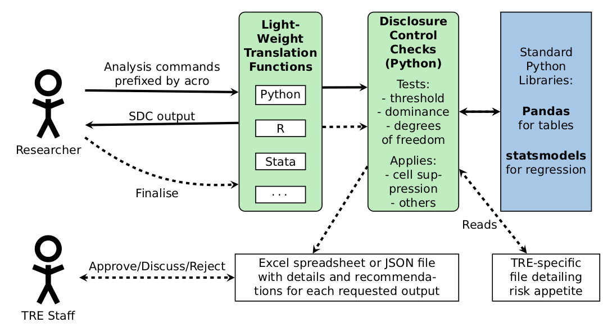

Welcome to ACRO
==============================

ACRO is a free and open source tool that supports the semi-automated checking of research outputs (SACRO) for privacy disclosure within secure data environments. This package acts as a lightweight Python tool that sits over well-known analysis tools to provide statistical disclosure control.

.. note::
   **New in v0.4.12 (Ontology-Driven Architecture):** ACRO's disclosure checking is now driven by a
   formal `StatbarnsSDC ontology <https://w3id.org/statbarnsdc>`_, making it easier to extend,
   audit, and reason about. See `How ACRO Works`_ below for full details.

What is ACRO?
=============

ACRO implements a principles-based statistical disclosure control (SDC) methodology that:

* Automatically identifies potentially disclosive outputs
* Applies optional disclosure mitigation strategies (suppression or rounding)
* Reports *why* each check was applied, grounded in a formal ontology
* Produces summary documents for output checkers

Example
=============

.. code-block:: python

   import acro
   import pandas as pd
   import numpy as np

   # Create synthetic data
   np.random.seed(42)
   df = pd.DataFrame({
       'region': np.random.choice(['North', 'South', 'East', 'West'], 1000),
       'income': np.random.choice(['Low', 'Medium', 'High'], 1000),
   })

   # Initialise ACRO with automatic suppression enabled
   session = acro.ACRO(suppress=True)

   # Create a cross-tabulation  disclosure checks happen automatically
   safe_table = session.crosstab(df.region, df.income)

   # Finalise and write outputs for the output checker to review
   session.finalise(output_folder="outputs")

Core Features
=============

Automated Disclosure Checking
-----------------------------

ACRO automatically runs disclosure tests on every output, checking for:

* **Cell threshold violations**  groups below the TRE's minimum cell count
* **Dominance (NK rule and p-ratio)**  one or two contributors dominating a cell
* **Degrees-of-freedom check**  saturated statistical models
* **Missing values**  cells that could reveal individuals through absence

Ontology-Driven Rule Engine
----------------------------

From v0.4.12 the set of checks that apply to each type of analysis is determined by the
`StatbarnsSDC ontology <https://w3id.org/statbarnsdc>`_ rather than hard-coded Python logic.
This means:

* Adding support for a new analysis type only requires updating the ontology, not the codebase.
* Every check applied to an output is traceable back to a defined risk in the ontology.
* FAIR (Findable, Accessible, Interoperable, Reusable) statements can be generated automatically.

See `How ACRO Works`_ below for a detailed walk-through.

Integration with Popular Libraries
----------------------------------

Works seamlessly with:

* **Pandas**  for data manipulation and table creation
* **Statsmodels**  for statistical modelling
* **R and Stata**  through wrapper packages

.. _how-acro-works:

How ACRO Works
==============

ACRO uses a three-phase pipeline for every analysis request:

**Phase 1  Session Initialisation**
   When you call ``acro.ACRO()``, an ``SDCChecks`` object is created and
   loaded with knowledge from four JSON lookup tables (``analyses.json``,
   ``checks.json``, ``risks.json``, ``statbarns.json``). These files are
   generated from the StatbarnsSDC ontology by ``ontology_handler.py`` and
   are bundled with every ACRO release, so no internet access is needed
   inside a TRE.

**Phase 2  Collect Evidence**
   When you call an analysis method (e.g. ``crosstab``), ACRO:

   1. Creates a ``TableModelDetails`` object that captures all parameters
      needed to reproduce the table.
   2. Looks up the relevant *statbarn* for the analysis type (e.g. "Mean").
   3. Determines from the ontology which *risks* apply, which *checks* are
      needed for those risks, and what *evidence* each check requires.
   4. Collects that evidence into an ``SDCEvidence`` object (e.g. a table
      of per-cell counts, a table of dominance values, residual
      degrees-of-freedom for regressions).

**Phase 3  Apply Checks and Produce Output**
   In *standalone* mode, the checks run immediately on the collected
   evidence.  Each check returns a status (``pass``, ``review``, or
   ``fail``) and a summary.  Results are combined and the chosen mitigation
   (suppression or rounding) is applied.  The output and audit record are
   stored in the ACRO session.

   In *federated* mode the evidence is sent to a trusted aggregator instead
   of running checks locally.

API Overview
============

The main ``ACRO`` class provides the interface for all disclosure checking. See the :doc:`api` documentation for complete details.

Key Parameters
--------------

.. list-table::
   :header-rows: 1
   :widths: 20 20 60

   * - Parameter
     - Type
     - Description
   * - ``suppress``
     - bool
     - Whether to suppress potentially disclosive outputs automatically
   * - ``federated``
     - bool
     - Whether to run in federated mode (send evidence to a trusted aggregator)

Key Methods
-----------

* :py:meth:`~acro.ACRO.crosstab`  Create cross-tabulations with disclosure checking
* :py:meth:`~acro.ACRO.pivot_table`  Create pivot tables with disclosure checking
* :py:meth:`~acro.ACRO.ols`  Ordinary least squares regression with disclosure checking
* :py:meth:`~acro.ACRO.finalise`  Prepare outputs for review by data controllers

Installation
============

Install ACRO using pip:

.. code-block:: bash

   pip install acro

Quick Start
===========

1. Import ACRO and initialise
2. Load your data
3. Run analysis  disclosure checks happen automatically
4. Finalise outputs for review

Next Steps
==========

* :doc:`installation`  Install ACRO and set up your environment
* :doc:`user_guide`  Follow the comprehensive user guide
* :doc:`examples`  Explore example notebooks and tutorials
* :doc:`api`  Check the complete API reference
