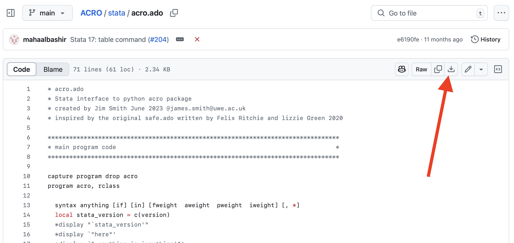

# This folder contains materials for getting acro working within Stata

Users can use *acro* thanks to libraries provided by Stata which manage the communications between Stata commands and acro's python 'engine'.

All you need is

1. For Stata and python to know how communicate with each other: which is managed by Stata's ```sfi``` package.
2. A simple **.ado** file that converts stata commands prefixed by the word *acro* into calls to the underlying python *acro* package

## Installation and testing

### Step 1: Checking for Stata upgrades.

You may need to check for updates as reported in
[this thread on the Stata forums](https://www.statalist.org/forums/forum/general-stata-discussion/general/1731732-bug-in-python-indentation)
if:

- you installed Stata before 20th December 2023, and
- you are using python3.12 or above

[Here is how to do it](https://www.stata.com/support/updates/stata18.html#:~:text=If%20you%20are%20using%20Stata,from%20within%20Stata%2C%20see%20below.)


### Step 2: Setting up Stata to use Python
[This blog from Stata](https://blog.stata.com/2020/08/18/stata-python-integration-part-1-setting-up-stata-to-use-python/)
describes the basic process of:

1. checking whether Stata can already find a version of python installed on your system
2. installing it if need be
3. setting up Stata to use python

We recommend that you install the latest version of Python compatible with acro (3.13 at the time of writing)


### Step 3: Installing acro for the preferred version of python

The next step is to install the python *acro* package.

1. From the Stata prompt type ```python query``` and then copy the full path to the python installation.
2. Open a terminal (mac, linux) or command prompt (windows)
3. Type ```<path you just copied>/python -m pip install acro``` to install *acro*

### Step 4. Including the file *acro.ado* where your Stata system can find it

**Step 4.1**: Get a copy of the file ```acro.ado``` from github.

Simply click on the filename [here](https://github.com/AI-SDC/ACRO/blob/main/stata/acro.ado)
then click on the download button as shown below



**Step 4.2:** During your initial installation and testing

You might want to leave ```acro.ado``` in the working directory from where you will be testing.
This could be anywhere is your personal 'home' file system.

Then at the start of your code you will need tell Stata how to find the file.
For example, if the file is in the current directory (".") you can type:
```adopath +"."```


**Step 4.3 (installation tests):**

In [this github repo](https://github.com/AI-SDC/ACRO/tree/main/stata)
we provide some example **.do** files for  versions of Stata
before and after the major change of syntax they introduced:

- ```stata_acro_test.do```,
- ```stata_acro_nursery.do```  and
- ```stata17_acro_nursery.do```.

These illustrate how to use the acro versions of some Stata commands,
and the outputs produced.
You may need to also copy the data file from [here](https://github.com/AI-SDC/ACRO/tree/main/data)

**Step 4.4:** Once you are satisfied with your testing

You might want to put the file somewhere where system users can access it, but not change it.

Stata has a folder system for storing common **.ado** files.
The location will depend  on your operating system as described [here](https://www.stata.com/manuals13/u17.pdf)
